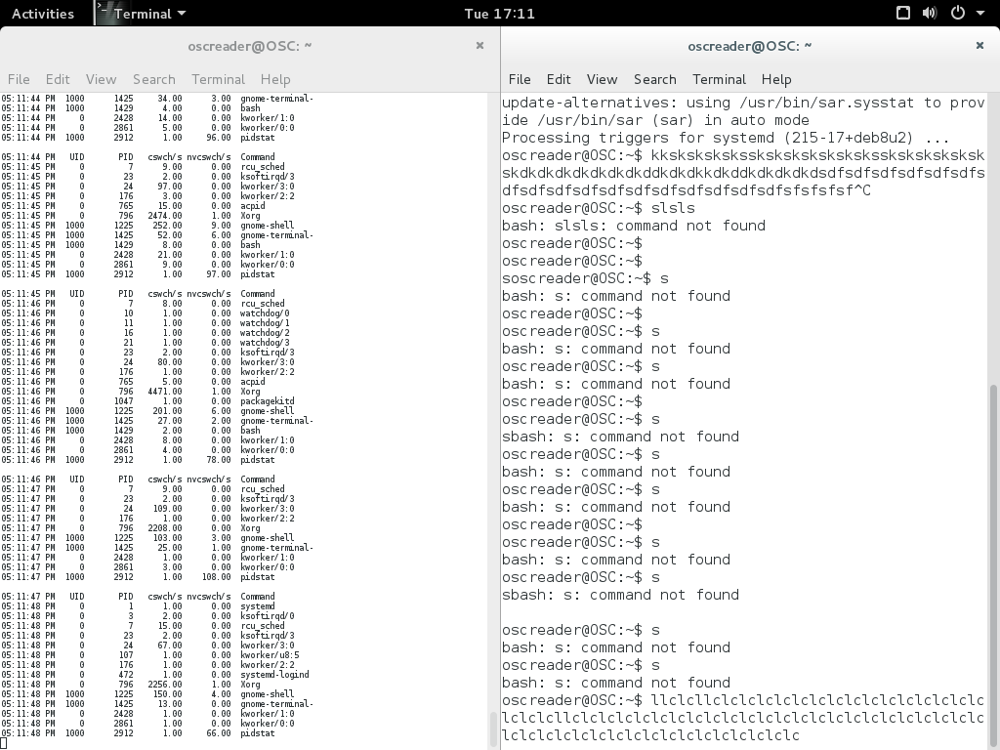

# Laboratorio 2
## Autores
- Josue Valenzuela

## Ejercicio 1

- ### 4 `fork`s seguidos
    ```c
    int main() {
        printf("PID ");
        fork(); fork(); fork(); fork();
    }
    ```
    ##### Compilacion:
    ```bash
    $ gcc ej1a.c -o a.o
    ```
    ##### Ejecucion
    ```bash
    $ chmod +x a.o
    $ ./a.o
    ```
    ##### Salida
    ```bash
    $ ./a.o
    PID PID PID PID PID PID PID PID PID PID PID PID PID PID PID PID
    ```
    El codigo solamente imprime `PID` una vez, por lo que cada PID pertenece a uno de los procesos que la llamada a `fork` genera.

- ### `fork` dentro de un ciclo de 4 iteraciones
    ```c
    int main() {
        for(int x = 0; x < 4; x++) { printf("PID "); fork(); }
    }
    ```
    ##### Compilacion:
    ```bash
    $ gcc ej1b.c -o b.o
    ```
    ##### Ejecucion
    ```bash
    $ chmod +x b.o
    $ ./b.o
    ```
    ##### Salida
    ```bash
    $ ./b.o
    PID PID PID PID PID PID PID PID PID PID PID PID PID PID PID PID PID PID PID PID PID PID PID PID PID PID PID PID PID PID PID PID PID PID PID PID PID PID PID PID PID PID PID PID PID PID PID PID PID PID PID PID PID PID PID PID PID PID PID PID PID PID PID PID
    ```
    El codigo debe de imprimir `PID` 4 veces por cada uno de los procesos, por lo que cada 4 `PID` son parte de un proceso.

- ¿Cuántos procesos se crean en cada uno de los programas?
    ```bash
    $ ./a.o | grep -o PID | wc -l
    16
    $ ./b.o | grep -o PID | wc -l | xargs -I n expr n / 4
    16
    ```
- ¿Por qué hay tantos procesos en ambos programas cuando uno tiene cuatro llamadas fork()y el otro sólo tiene una?

    El numero de procesos es 2^n donde n es el numero de llamadas a `fork`. Esto viene dado, por la duplicacion de los procesos de `fork`

    > `fork()` creates a new process by duplicating the calling process. The new process, referred to as the child, is an exact duplicate of the calling process

    En el primer programa el numero es 16 por que se ejecuta `fork` 4 veces, por lo que el numero de procesos es 2^4=16. En el segundo programa funciona con el mismo principio, en este caso hay 16 procesos debido a que cada vez que se ejecuta `fork` el proceso que se duplica es el ciclo que contiene tambien 4 llamadas a `fork`, entonces el numero total de procesos viene dado por 2^4. Creditos a la explicacion de [stack overflow](https://stackoverflow.com/questions/26793402/visually-what-happens-to-fork-in-a-for-loop)

## Ejercicio 2
- ### Ejecutacion regular
    ```c
    int main() {
        clock_t start, end;
        start = clock();
        for(int i = 0; i < 1000000; i++); for(int i = 0; i < 1000000; i++); for(int i = 0; i < 1000000; i++);
        end = clock();
        double diff = (double) end - start; printf("%f\n", diff);
    }
    ```
    ##### Compilacion:
    ```bash
    $ gcc ej2a.c -o a.o
    ```
    ##### Ejecucion
    ```bash
    $ chmod +x a.o
    $ ./a.o
    ```
    ### Ejecute su programa varias veces
    ```bash
    $ for n in {1..5}; do ./a.o; done
    22999.000000
    9444.000000
    6795.000000
    5531.000000
    5329.000000
   ```

- ### Ejecucion concurrente
    ```c
    #include <stdio.h>
    #include <time.h>
    #include <sys/wait.h>

    int main() {
        pid_t son, grandson, grandgrandson;
        clock_t start, finish;

        start = clock();
        son = fork();

        if(son == 0 ) {
            grandson = fork();
            if(grandson == 0) {
                grandgrandson = fork();
                if(grandgrandson == 0) {
                    for(int i = 0; i < 1000000; i++);
                } else {
                    for(int i = 0; i < 1000000; i++);
                    wait(NULL);
                }
            } else {
                for(int i = 0; i < 1000000; i++);
                wait(NULL);
            }
        } else {
            wait(NULL);
            finish = clock();
            double diff = (double) finish - start; printf("%f\n", diff);
        }
    }
    ```
    ##### Compilacion:
    ```bash
    $ gcc ej2b.c -o b.o
    ```
    ##### Ejecucion
    ```bash
    $ chmod +x b.o
    $ ./b.o
    ```
    ### Ejecute su programa varias veces
    ```bash
    $ for n in {1..5}; do ./b.o; done
    278.000000
    322.000000
    304.000000
    327.000000
    180.000000
    ```
- ### ¿Cuál, en general, toma tiempos más largos?
La ejecucion secuencial (sin `fork()`) toma mas tiempo.
- ### ¿Qué causa la diferencia de tiempo, o por qué se tarda más el que se tarda más?
El agregarle concurrencia al programa, y no importar el orden, el balanceo de los procesos del sistema operativo es mas eficiente en la ejecucion de los mismos. Aunque no programamos que funcionaran de manera paralela, el sistema operativo puede balancearlos de tal manera que se ejecuten de forma paralela.

## Ejercicio 3
```bash
pid -w 1
```


- ¿Qué tipo de cambios de contexto incrementa notablementeen cada caso, y por qué?

    Los cambios de contexto voluntarios incrementan constantemente. Al ser `Xorg` el manejador de ventanas, necesita cambiar de contexto constantemente.

```c
int main() {
    clock_t start, end;
    start = clock();
    int i;
    for(i = 0; i < 1000000; i++) {printf("%d\n",i);}
    for(i = 0; i < 1000000; i++) {printf("%d\n",i);}
    for(i = 0; i < 1000000; i++) {printf("%d\n",i);}
    end = clock();
    double diff = ((double) end - start) / CLOCKS_PER_SEC; printf("%f\n", diff);
}
```
### Ejecucion
```bash
$ ./a.o
.
.
.
999997
999998
999999
6.622200
```

```c
int main() {
    pid_t son, grandson, grandgrandson;
    clock_t start, finish;
    int i;

    start = clock();
    son = fork();

    if(son == 0 ) {
        grandson = fork();
        if(grandson == 0) {
            grandgrandson = fork();
            if(grandgrandson == 0) {
                for(i = 0; i < 1000000; i++) {printf("%d\n",i);}
            } else {
                for(i = 0; i < 1000000; i++) {printf("%d\n",i);}
                wait(NULL);
            }
        } else {
            for(i = 0; i < 1000000; i++) {printf("%d\n",i);}
            wait(NULL);
        }
    } else {
        wait(NULL);
        finish = clock();
        double diff = ((double) finish - start ) / CLOCKS_PER_SEC; printf("%f\n", diff);
    }
}
```
### Ejecucion
```bash
$ ./a.o
.
.
.
999997
999998
999999
0.000235
```
- ¿Qué diferencia hay en el númeroy tipo de cambios de contexto de entre programas?
-¿A qué puede atribuir los cambios de contexto voluntarios realizadospor sus programas?
- ¿A   qué   puede   atribuir   los   cambios   de   contexto   involuntarios   realizados  porsus programas?
- ¿Por  qué  el  reporte  de  cambios  de  contexto  para  su  programa  con `fork()`s muestra cuatro procesos, uno de los cuales reporta cero cambios de contexto?